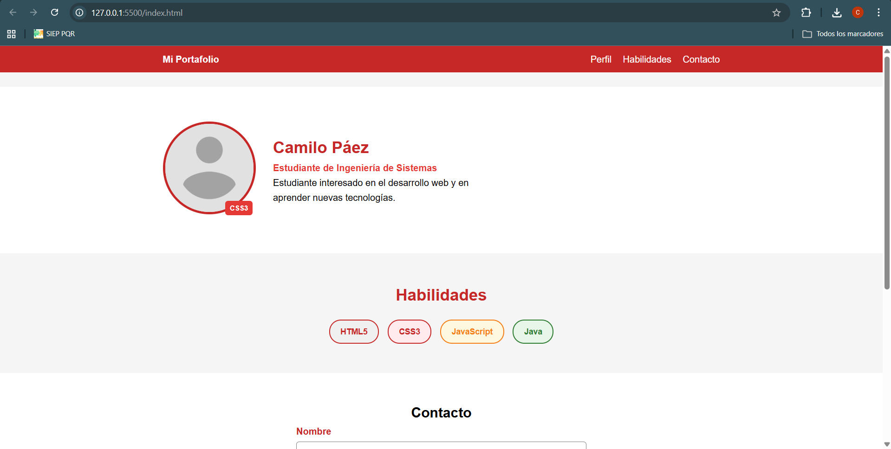

# Página de Perfil — Camilo Páez

## 📌 Descripción

Este proyecto consiste en la creación de una página web de perfil personal utilizando HTML5 y CSS3, aplicando conceptos como selectores avanzados, Box Model, posicionamiento y estilos de formularios.

## 🚀 Tecnologías utilizadas

- HTML5
- CSS3

## 📂 Estructura del proyecto

- index.html
- css/estilos.css
- img/perfil.png
- captura.png

## ▶️ Cómo ejecutar el proyecto

1. Abrir la carpeta en Visual Studio Code
2. Abrir el archivo `index.html`
3. Ejecutar con la extensión **Live Server**

## 📸 Captura del proyecto

